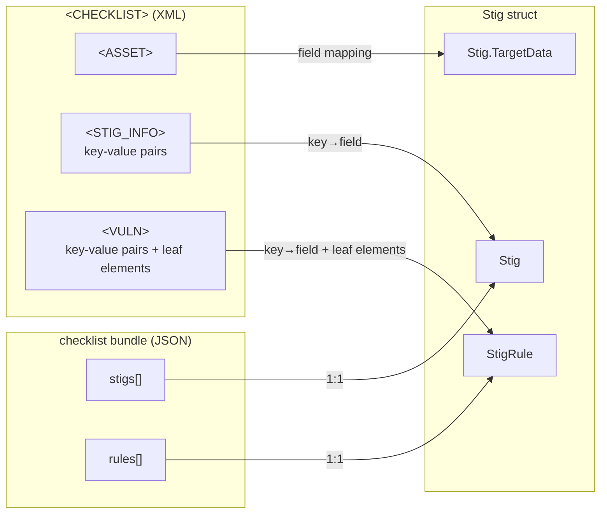

# Checklist Format Field Mapping

## Overview

Two checklist formats both represent a STIG assessment result:
- **`.ckl`** — XML, the legacy DISA STIG Viewer format
- **`.cklb`** — JSON, the newer "checklist bundle" format

The internal `Stig` struct is designed around the `.cklb` JSON shape, so `.ckl`
XML must be unwound into key-value pairs and normalized during parsing.

## Mermaid Diagram

## Format → Go struct mapping

### Top-level: `Stig`

| CKL XML path | CKLB JSON path | `Stig` field | Notes |
|---|---|---|---|
| `STIGS/iSTIG/STIG_INFO//title` | `stigs[].title` | `Title` | |
| `STIGS/iSTIG/STIG_INFO//stigid` | `stigs[].stig_id` | `StigID` | |
| `STIGS/iSTIG/STIG_INFO//version` | `stigs[].version` | `Version` | |
| `STIGS/iSTIG/STIG_INFO//releaseinfo` | `stigs[].release_info` | `ReleaseInfo` | |
| `STIGS/iSTIG/STIG_INFO//uuid` | `stigs[].uuid` | `Uuid` | |
| — | `stigs[].stig_name` | `StigName` | CKL only: built from `title` + `version` |
| — | `stigs[].display_name` | `DisplayName` | CKL only: derived or empty |
| — | `stigs[].size` | `Size` | CKL only: computed from rule count |
| — | `stigs[].cklb_version` | `CklbVersion` | CKL only: empty / not present |

### Target data: `Stig.TargetData`

| CKL XML path | CKLB JSON path | `TargetData` field |
|---|---|---|
| `ASSET/ROLE` | `stigs[].target_data.role` | `Role` |
| `ASSET/ASSET_TYPE` | `stigs[].target_data.target_type` | `TargetType` |
| `ASSET/HOST_NAME` | `stigs[].target_data.host_name` | `HostName` |
| `ASSET/HOST_IP` | `stigs[].target_data.ip_address` | `IpAddress` |
| `ASSET/HOST_MAC` | `stigs[].target_data.mac_address` | `MacAddress` |
| `ASSET/HOST_FQDN` | `stigs[].target_data.fqdn` | `Fqdn` |
| `ASSET/TARGET_COMMENT` | `stigs[].target_data.comments` | `Comments` |
| `ASSET/TECH_AREA` | `stigs[].target_data.technology_area` | `TechnologyArea` |
| `ASSET/WEB_OR_DATABASE` | `stigs[].target_data.is_web_database` | `IsWebDatabase` |
| `ASSET/WEB_DB_SITE` | `stigs[].target_data.web_db_site` | `WebDbSite` |
| `ASSET/WEB_DB_INSTANCE` | `stigs[].target_data.web_db_instance` | `WebDbInstance` |

### Rule: `StigRule`

**Key-value pairs from `<STIG_DATA>`**

| `VULN_ATTRIBUTE` value | CKLB JSON path | `StigRule` field |
|---|---|---|
| `Vuln_Num` | `.group_id`, `.group_id_src` | `GroupId`, `GroupIdSrc` |
| `Severity` | `.severity` | `Severity` |
| `Group_Title` | `.group_title` | `GroupTitle` |
| `Rule_ID` | `.rule_id`, `.rule_id_src` | `RuleId`, `RuleIdSrc` |
| `Rule_Ver` | `.rule_version` | `RuleVersion` |
| `Rule_Title` | `.rule_title` | `RuleTitle` |
| `Vuln_Discuss` | `.discussion` | `Discussion` |
| `IA_Controls` | `.ia_controls` | `IaControls` |
| `Check_Content` | `.check_content` | `CheckContent` |
| `Fix_Text` | `.fix_text` | `FixText` |
| `False_Positives` | `.false_positives` | `FalsePositives` |
| `False_Negatives` | `.false_negatives` | `FalseNegatives` |
| `Documentable` | `.documentable` | `Documentable` |
| `Mitigations` | `.mitigations` | `Mitigations` |
| `Potential_Impact` | `.potential_impacts` | `PotentialImpacts` |
| `Third_Party_Tools` | `.third_party_tools` | `ThirdPartyTools` |
| `Mitigation_Control` | `.mitigation_control` | `MitigationControl` |
| `Responsibility` | `.responsibility` | `Responsibility` |
| `Security_Override_Guidance` | `.security_override_guidance` | `SecurityOverrideGuidance` |
| `Check_Content_Ref` | `.check_content_ref.name` | `CheckContentRef.Name` |
| `Weight` | `.weight` | `Weight` |
| `Class` | `.classification` | `Classification` |
| `STIGRef` | `.stig_ref` | `StigRef` |
| `TargetKey` | `.target_key` | `TargetKey` |
| `STIG_UUID` | `.stig_uuid` | `StigUuid` |
| `LEGACY_ID` (N entries) | `.legacy_ids` | `LegacyIds []string` |
| `CCI_REF` (N entries) | `.ccis` | `Ccis []string` |

**Leaf elements (outside `<STIG_DATA>`)**

| CKL element | CKLB JSON path | `StigRule` field | Casing normalization |
|---|---|---|---|
| `<STATUS>` | `.status` | `Status` | `Open`→`open`, `Not_Reviewed`→`not_reviewed`, `NotAFinding`→`not_a_finding`, `Not_Applicable`→`not_applicable` |
| `<FINDING_DETAILS>` | `.finding_details` | `FindingDetails` | |
| `<COMMENTS>` | `.comments` | `Comments` | |

## Fields unique to each format

### `.cklb` only (no CKL equivalent)

| Field | Purpose |
|---|---|
| `Stig.DisplayName` | Short display label |
| `Stig.Size` | Expected rule count |
| `Stig.Id` | Internal DB id |
| `Stig.Active` | Soft-delete flag |
| `Stig.Mode` | Operational mode |
| `Stig.HasPath` | File path tracking |
| `StigRule.Uuid` | Per-rule unique id |
| `StigRule.GroupTree` | Hierarchical grouping |
| `StigRule.Overrides` | Override struct (empty in practice) |
| `StigRule.CheckContentRef.Href` | Reference URL |

### `.ckl` only (no CKLB equivalent)

| XML path | Notes |
|---|---|
| `ASSET/ROLE` | Stored in `TargetData.Role` (CKLB uses empty) |
| `ASSET/ASSET_TYPE` | Stored in `TargetData.TargetType` |
| `ASSET/MARKING` | Classification marking — not in struct |
| `STIG_INFO//source` | Origin source — not in struct |
| `VULN/SEVERITY_OVERRIDE` | Override value — not in struct |
| `VULN/SEVERITY_JUSTIFICATION` | Override reason — not in struct |
